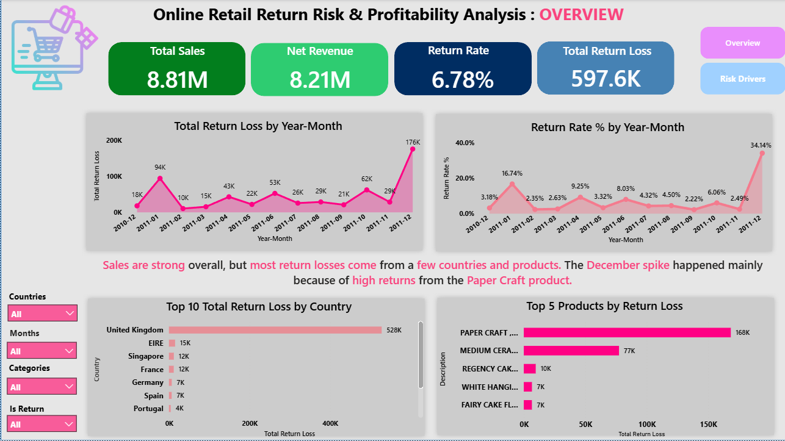
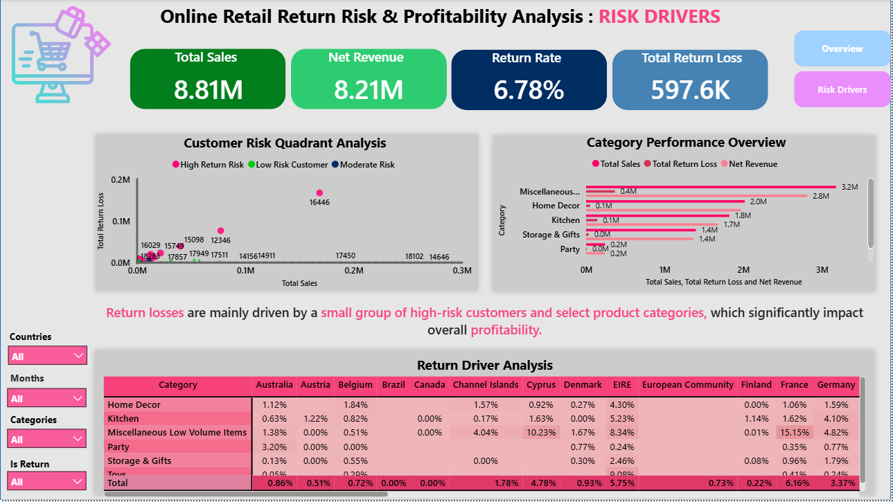

# Online Retail Return Risk Profitability Analysis
Data analysis project to identify Return Risk Patterns in Online Retail using Excel, SQL, and Power BI.

## Dashboard
This dashboards shows return risk patterns across customers and product categories.
### Retail Summary Dashboard
This dashboard provides an overview of Sales, Returns, and Overall Profitability.

### Retail Risk Drivers Dashboard
This dashboard highlights the main factors that contribute to Product Returns and Return Risk.

## Key Business Insights
- The total sales in the dataset are **8.81M**, but around **597K is lost because of Product Returns**, which reduces overall profit.
- The overall **Return Rate is 6.78%**, showing that returns have a noticeable impact on the business.
- **United Kingdom has the highest return loss (528K)** compared to other countries, making it the main region contributing to return losses.
- At the product level, **Paper Craft products have the highest return loss (~168K)**, which may indicate issues related to product quality or customer expectations.
- The analysis also shows that **a Small Number of Customers are Responsible for Many of the Returns**, which suggests that monitoring high-return customers could help reduce losses.

## Business Recommendations
- Monitor customers who frequently return products. Setting limits or reviewing high-return accounts can help reduce unnecessary return losses.
- Investigate products with the highest return losses, especially **Paper Craft items**, to understand whether the issue is related to product quality, packaging, or customer expectations.
- Focus on countries with the highest return losses, such as the **United Kingdom**, and analyze the reasons behind the higher return rates in that region.
- Improve product descriptions and images on the online store so customers clearly understand what they are buying, which may reduce incorrect purchases and returns.
- Track return patterns regularly using dashboards so the business can quickly identify high-risk products or customers and take action earlier.

## Project Description
This project analyzes online retail transaction data to identify return risk patterns and understand their impact on business profitability.
The analysis was performed using SQL, Excel, and Power BI to explore return behavior, calculate key metrics, and build an interactive dashboard for business insights.

